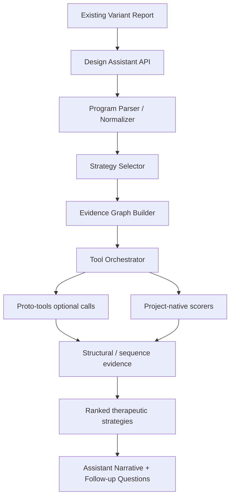

# HelixDesign v1 Implementation Plan

## 1. Goal
Build a separate therapeutic reasoning assistant that sits on top of the existing Evo2 variant analysis pipeline without changing the current analysis flow.

The assistant should help a reviewer answer:
- What therapeutic direction does this variant suggest?
- What structural or functional mechanism is most likely affected?
- What additional analyses should be run next?
- Which open-source biology tools can support that reasoning?

This is not a replacement for the Evo2 analysis stack. It is a new layer that consumes the report output and adds strategy, interpretation, and next-step recommendations.

## 2. Non-Goals
Do not modify the existing core pipeline unless absolutely required.

Specifically, v1 should not:
- Replace Evo2 on Modal
- Change the current CADD, AlphaMissense, PubMed, or ISM logic
- Rebuild the frontend analysis flow
- Depend on Proto as the main project identity
- Start with a full CRISPR design product

## 3. Design Principle
The assistant should be Proto-inspired, not Proto-dependent.

Use the Proto paper as a conceptual guide for:
- Composing sequences, constraints, generators, and optimizers
- Thinking in terms of modular design programs
- Using multiple tools as factors in a reasoning graph
- Breaking a complex biological decision into staged analysis

However, the implementation should be owned by this project:
- The program schema is yours
- The orchestration logic is yours
- The ranking/scoring logic is yours
- The UI/UX is yours

`proto-tools` may be used as an optional capability provider, not as the architectural core.

## 3.1 LLM Model Choice (Verified)
**Primary model:** NVIDIA Nemotron-3 Ultra 550B (`nvidia/nemotron-3-ultra-550b-a55b`)

- **Endpoint:** `https://integrate.api.nvidia.com/v1/chat/completions`
- **Auth:** Bearer token via `NVIDIA_API_KEY` (stored in `frontend/.env.local`)
- **API style:** OpenAI-compatible REST (no `extra_body` support on direct REST; use clean payload)
- **Key features:** 1M context, agentic reasoning, tool calling, hybrid Mamba-Transformer MoE
- **Latency:** ~24s for 600-token response (acceptable for assistant use)
- **Reasoning quality:** Verified good — correctly identifies evidence conflicts and proposes sensible next steps
- **Fallback:** Groq Llama 3.3 70B for lower latency / cost-sensitive paths

**Verified test result (2026-06-28):**
- Status 200, model returned both `reasoning_content` and `content`
- Correctly analyzed a BRCA1 missense variant with conflicting Evo2/AlphaMissense/CADD/ISM signals
- Proposed: functional validation, orthogonal evidence integration, predictor limitation review, expert escalation

## 4. v1 Product Scope
v1 should provide a single user-facing action:

"Design Therapeutics" or "Reason About This Variant"

Given an analyzed variant report, the assistant should return:
- A recommended therapeutic strategy class
- A short rationale for why that strategy is appropriate
- A ranked list of follow-up analyses
- Optional tool-backed evidence if relevant
- A natural-language explanation suitable for a professor or researcher audience

## 5. Recommended v1 Focus
The safest and strongest first version is not CRISPR.

Recommended initial scope:
- Variant-to-therapy reasoning
- Structural impact explanation
- Evidence synthesis using the existing report data
- Optional tool-assisted follow-up using `proto-tools`

Avoid making CRISPR the first demo because the earlier CRISPR off-target effort did not reach a reliable end-to-end state.

## 6. High-Level Architecture

## 7. Inputs and Outputs

### Input
The assistant should consume the saved analysis report or the API response from the main analysis endpoint.

Expected input fields:
- Gene symbol
- Variant position
- Reference and alternative alleles
- Predicted consequence
- Evo2 prediction and delta score
- External scores such as CADD and AlphaMissense
- Consensus output
- Clinical summary and ACMG evidence
- Optional ISM output
- Optional protein/domain annotations

### Output
The assistant should return a structured object with:
- `strategy_class` - e.g. structural rescue, splice rescue, allele-specific targeting, binder design, observe/review
- `confidence` - low, medium, or high
- `reasoning_summary` - short natural-language rationale
- `evidence_bullets` - source-backed points
- `recommended_next_steps` - ranked actions
- `tool_calls` - optional executed tools and their outputs
- `limitations` - what is missing or uncertain

## 8. v1 Strategy Taxonomy
Use a small, explicit strategy set.

Start with these classes:
- `observe_and_reassess`
- `structural_rescue`
- `splice_rescue`
- `allele_specific_targeting`
- `protein_binder_design`
- `literature_and_evidence_review`

This keeps the assistant interpretable and avoids overpromising.

## 9. Core Modules to Build

### 9.1 `agent.py`
Main orchestration entry point.
Responsibilities:
- Accept a variant report
- Normalize the input
- Ask the strategy selector for the best class
- Call tool-specific submodules when needed
- Assemble the final assistant response

### 9.2 `strategy_selector.py`
Rule-based plus LLM-assisted routing.
Responsibilities:
- Decide which strategy class is appropriate
- Map features to candidate actions
- Produce a confidence estimate

Example routing logic:
- Missense in a known protein domain -> structural_rescue
- Splice-site or intronic consequence -> splice_rescue
- High-confidence pathogenic coding variant -> allele_specific_targeting or protein_binder_design
- Weak evidence / no actionable signal -> observe_and_reassess

### 9.3 `evidence_graph.py`
Build a compact reasoning graph from existing report data.
Responsibilities:
- Turn report fields into evidence nodes
- Connect nodes such as Evo2, CADD, AlphaMissense, ISM, ClinVar, PubMed, UniProt
- Provide a machine-readable summary for the assistant

### 9.4 `tool_orchestrator.py`
Manage optional backend tool calls.
Responsibilities:
- Determine whether a tool call is needed
- Execute supported tool calls
- Collect outputs and normalize them into a common schema
- Keep the assistant robust if a tool is unavailable

### 9.5 `proto_tools_client.py`
Thin wrapper around `proto-tools`.
Responsibilities:
- Encapsulate tool invocation details
- Allow swapping local vs hosted execution later
- Keep the assistant logic independent from tool implementation details

### 9.6 `response_builder.py`
Convert internal reasoning into the final assistant response.
Responsibilities:
- Produce a concise narrative
- Attach structured evidence
- Add limitations and next-step suggestions
- Format output for the frontend

## 10. Suggested Tool Usage in v1
Use `proto-tools` selectively where it adds visible value.

Best first tools:
- `UniProt Fetch` - protein function and domains
- `PDB Fetch` or `AlphaFold DB Fetch` - structure metadata and model links
- `ESMFold` or `ESMFold2` - structure prediction for relevant protein context
- `USalign` or `TMalign` - structural comparison if mutant vs wild-type structures are available
- `pDockQ2` or `IPSAE` - interface quality if a binding interface is relevant
- `SpliceAI` or `Pangolin` - splicing-related follow-up when the variant is intronic or near splice junctions
- `Evo2 Scoring` - if a follow-up sequence score is useful for reasoning

Avoid overusing tools just because they exist. Each call should support a specific clinical or research claim.

## 11. v1 Assistant Behavior
The assistant should behave like a compact research co-pilot.

It should:
- Explain why a variant is interesting or actionable
- Suggest one or two plausible therapeutic directions
- Say when the evidence is insufficient
- Distinguish between computational signal and validated biological effect
- Avoid pretending to provide medical advice

It should not:
- Pretend to be a full clinical decision system
- Invent therapeutic claims without evidence
- Overfit to a single modality
- Hide uncertainty

## 12. Frontend Integration
Add one new panel to the saved report modal.

Suggested UI label:
- `Design Therapeutics`
- `Reason About This Variant`
- `Therapeutic Strategy`

The panel should show:
- Strategy summary
- Reasoning bullets
- Evidence sources used
- Tool outputs if present
- Follow-up questions the user can ask

## 13. API Shape
Recommended endpoint:

`POST /api/design-assistant`

Request body:
- `variant_report` - full report object or minimal normalized subset
- `mode` - `auto`, `review`, `structural`, `splice`, `targeting`
- `tool_budget` - optional cap on tool calls

Response body:
- `strategy_class`
- `confidence`
- `reasoning_summary`
- `evidence_bullets`
- `recommended_next_steps`
- `tool_outputs`
- `limitations`
- `generated_at`

## 14. Implementation Phases

### Phase 1 - Reasoning Skeleton
Build the pure project-native logic first.
Deliverables:
- Input normalization
- Strategy selector
- Evidence graph builder
- Basic response builder
- Frontend panel stub

### Phase 2 - Optional Tool Backends
Add `proto-tools` clients for evidence enrichment.
Deliverables:
- UniProt / PDB / AlphaFold DB lookups
- Structure comparison helpers
- Optional splicing follow-up

### Phase 3 - Richer Therapeutic Analysis
Expand into the highest-value design directions.
Deliverables:
- Structural rescue reasoning
- Splice rescue reasoning
- Allele-specific targeting heuristics
- Better ranking and explanation formatting

### Phase 4 - Public Demo Polish
Prepare the professor-facing presentation flow.
Deliverables:
- Example variants
- Clear output styling
- Stable tool fallback behavior
- Fast demo path with no long-running calls

## 15. Acceptance Criteria for v1
The v1 assistant is successful if it can:
- Read an existing variant report
- Return one clear therapeutic strategy class
- Provide a short, evidence-based explanation
- Show at least one useful follow-up step
- Use optional tools only when they strengthen the reasoning
- Preserve the current Evo2 analysis pipeline unchanged

## 16. Risks and Constraints
- CRISPR is still a risky first target because the earlier effort was not stable
- Some `proto-tools` calls may require setup or may be too slow for live demo use
- Structural predictions can be valuable, but should not be presented as definitive
- The assistant must remain transparent about uncertainty
- The design layer should not be framed as clinical advice without proper validation

## 17. Suggested First Milestone
Build the reasoning-only version first.

That means:
- No new biology model integration yet
- No UI redesign beyond a single panel
- No CRISPR generation loop
- No replacement of Evo2 or the main report pipeline

Just make the assistant able to explain:
- what the variant likely affects
- why a strategy is suggested
- what should be checked next

That gives a strong, low-risk demonstration and leaves room to add `proto-tools` support afterward.
